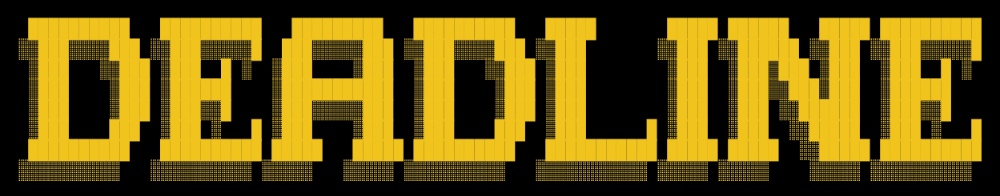

<p align="center">

</p>

DEADLINE is a text adventure that plays like a late-90s BBS. You dial in, the board knows your name, and somebody called `ghost_17` has been waiting for you.

It runs in your terminal and uses Rust and Ratatui. The art is half-block pixel sprites and CP437 block art, so it looks like a real board instead of a menu with a story painted on top. It opens on a short animated title, and any key or click skips it.

The board's last public post is from 08/14/1998. It says `DON'T SHUT IT DOWN.` Nobody did.


## What it's like

There are no dialogue menus floating over the game. You type commands like you would on an actual BBS:

- read message boards full of old posts, arguments, bad ANSI art and pizza opinions
- check your mail and `finger` users to read their `.plan` files
- open private channels with people who are online (and some who shouldn't be)
- dig through the file area, `inspect` files and download them over fake ZMODEM
- find commands nobody told you about

The story keeps track of what you do without showing you a single number. Who you trust, what you read, who you lied to, and which doors you opened all change what people will tell you later. Some choices look tiny. A few of them really aren't.

Right now the game contains **Act I: CONNECTION**, **Act II: ARCHIVES**, **Act III: 1998**, **Act IV: IDENTITY** and **Act V: DECISION**. Acts I and II each have several routes and four ways to end, depending on who you've trusted and who you've been honest with, and how Act I ends changes how Act II begins. Act III drops you into the night of 08/14/1998 with everyone still alive, and the night keeps rebuilding itself every time you try to change it. Act IV brings you back to the present and turns the mystery toward you. Act V is the last night. JANUS leaves its own core open for you to dig through, and then you decide what happens to DEADLINE by typing it. There are nine endings, and the ones you can reach depend on everything you did before. Finishing one starts a fresh run, and the game remembers what you've seen.

Acts happen on different nights. When you finish one, the board lets you poke around for a few more minutes, then ROOT hangs up on you. Log in again to start the next act.

## Installation

You need a recent Rust toolchain. I've been building with Rust 1.96.

```bash
git clone https://github.com/pinkpixel-dev/deadline.git
cd deadline
cargo run --release
```

The game uses truecolor, so a modern terminal works best. I'd go for at least 96 columns wide so the sidebar shows up, but it still plays fine in a narrow window (the sidebar just hides).

## Playing

You don't have to memorize anything. Every list the board prints (boards, posts, mail, files, users) is clickable. Tap or click a row to open it, or press **↓** on an empty prompt to step into the list, then **↑↓** and **Enter**. Posts and files get little action rows underneath, like `› next`, `‹ back to CODE` or `↓ download`, and notices like `*** PRIVATE MESSAGE` can be tapped too.

You can also type just the number or name you see. `03` opens a board, `102` reads a post, and `nodelist.txt` opens a file from the list on screen. `read` or `view` with nothing after it shows you what's there. Boards open by name too (`open trading`).

If you'd rather type everything, the commands are all still there. Type `help` once you're logged in. The basics:

| Command | What it does |
| --- | --- |
| `boards`, `open <#>` | list boards, enter one |
| `read <#>`, `n` | read a message, next unread |
| `mail [#]` | your mailbox |
| `users`, `finger <user>` | who's online, look someone up |
| `chat <user>`, `reply [user]`, `leave` | private channels |
| `files`, `cd <dir>`, `view <file>` | the file area |
| `inspect <file>`, `download <file>` | file details, ZMODEM |
| `send <user> <file>` | send a downloaded file to someone who's online |
| `journal`, `note <text>` | what you've learned, your own notes |
| `history` | your command history |
| `snapshot [name]`, `restore [name]` | save and load |
| `speed <slow\|normal\|fast\|instant>` | how fast text arrives |
| `logout` | hang up |

There are more commands than that. You'll find them.

A few controls worth knowing:

- **Tab** completes commands, board numbers, users and filenames
- **Down** on an empty prompt picks from the latest list. **Up** browses your command history
- **PgUp/PgDn** or the mouse wheel scrolls back
- **Enter** or a click skips a cinematic
- In a conversation, press **1-9**, use the arrows, or click a reply. You can still type commands mid-conversation if you want to check something first.
- **Ctrl+C** twice logs you off

### Your journal

Type `journal` any time to see what you've found out so far. It lists open leads (crossed off once you've dealt with them), keys and passwords, the people you've met, files you've downloaded and commands you've discovered. If you come back after a few days and can't remember where you were, start there.

You can add your own notes with `note <text>`, like `note ghost seems scared of ROOT`. Remove one with `note rm 2`. The journal is a file on your computer, not on the BBS, so your notes stick around even when you restore a snapshot.

### Saving

When you log off, your session is saved and the board remembers you next time. `snapshot` and `restore` work like normal save slots.

Mostly.

### Starting over

```bash
cargo run --release -- --reset
```

That hangs up your old session and dials in fresh. Some things survive anyway.

## Where your data lives

Saves go in your platform's data directory (`~/.local/share/deadline` on Linux). You can point it somewhere else with the `DEADLINE_HOME` environment variable.

## Writing story content

The whole story lives in `.ron` files under `assets/story/`, so the engine and the writing stay separate. Boards, posts, mail, files, users, conversations, scheduled events and scripted commands are all data. Sprites are plain-text pixel grids in `assets/sprites/`.

If you edit content, run the validator. It catches typos in flag names, broken conversation links and missing sprites:

```bash
cargo run -- --check
```

`DOCS/OVERVIEW.md` explains the content format in more detail.

## License

Apache 2.0. See [LICENSE](LICENSE).

The visual style was inspired by [Rebels in the Sky](https://github.com/ricott1/rebels-in-the-sky), which proved Ratatui can do real pixel art.

---

Made with 💖 by [Pink Pixel](https://pinkpixel.dev)
